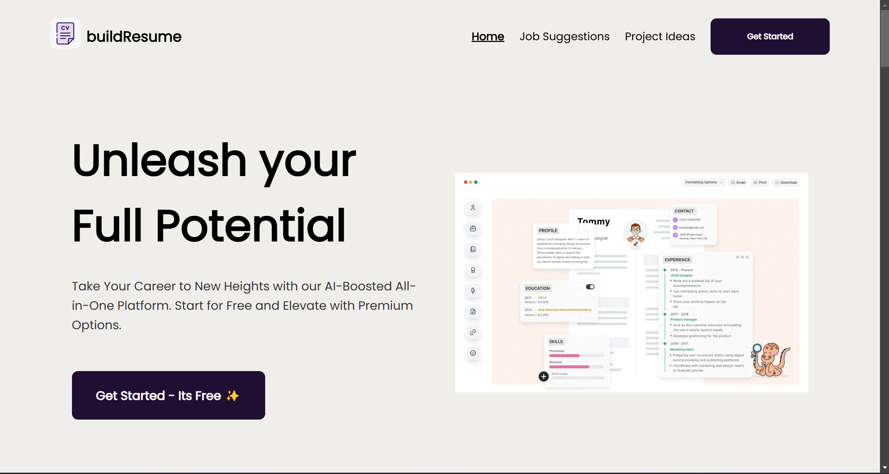
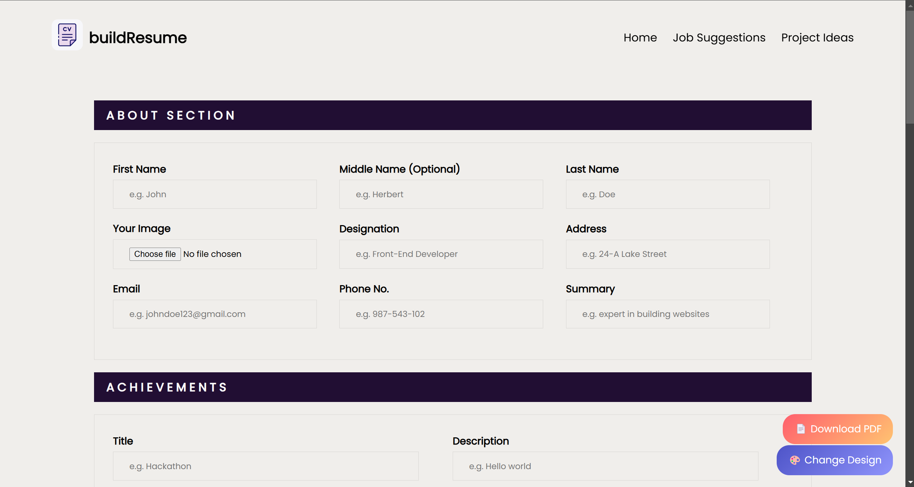

# Resume Builder Website

This is a web application designed to help users build their resumes, get job suggestions based on their skills, and find project ideas to improve their abilities. The website uses various technologies including HTML, CSS, JavaScript, Firebase, and popular libraries such as SweetAlert to enhance the user experience.

## Features

- **Resume Builder**: Allows users to create and customize their resumes by adding sections such as achievements, education, experience, projects, and skills.
- **Job Suggestions**: Provides job suggestions based on the user's skills.
- **Project Ideas**: Suggests relevant project ideas to help users enhance their skills.
- **Firebase Authentication**: Uses Firebase for user authentication (login/signup).
- **Animations**: Includes various animations like a loading spinner and transition effects, implemented with CSS.
- **SweetAlert**: Provides better user interaction with alert messages using the SweetAlert library.
- **Vanilla JavaScript**: All logic for the website is written using pure JavaScript.

## Technologies Used

- **HTML**: Structure and layout of the website.
- **CSS**: Styling and animations.
- **JavaScript**: Logic for dynamic behavior and interactivity.
- **Firebase**: For user authentication (login/signup).
- **SweetAlert**: For beautiful pop-up alerts.
- **Vanilla JS**: Used for interactivity without relying on any additional libraries.

## How to Use

1. Clone this repository to your local machine using:
   https://github.com/slakshya-22/M4-GEEKATHON.git
2. Open the project in your preferred code editor.

3. To run the project locally:
- Open the `index.html` file in a web browser.

4. Sign up or log in using Firebase Authentication to save your data securely.

5. Use the resume builder to add your details, and explore job suggestions and project ideas.

## Project Structure

- `index.html`: The main HTML file that contains the structure of the website.
- `style.css`: Contains the styles for the website, including animations.
- `script.js`: Contains the JavaScript code for the functionality of the resume builder, job suggestions, and project ideas.
- `firebase.js`: Firebase setup for user authentication.
- `assets/`: Contains images, icons, and other media used in the website.

## Screenshots

## Contributing

If you'd like to contribute to this project, feel free to fork the repository and submit a pull request. Make sure to follow the code style and best practices.

## License

This project is licensed under the MIT License - see the [LICENSE](LICENSE) file for details.

